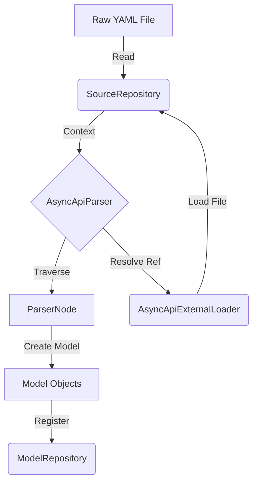

# Parsing Mechanics & Data Flow

This document details the internal mechanics of the parsing engine, specifically focusing on the data flow, the role of 
`ParserNode` in traversal, and the architectural patterns used for model representation.

## 1. The `AsyncApiContext` Ecosystem

The parsing process is not a stateless operation. It revolves around the `AsyncApiContext`, which acts as the central 
nervous system connecting three key repositories.

### Data Flow Diagram



### Components

*   **`SourceRepository`:**
    *   **Input:** Raw YAML/JSON content.
    *   **Role:** It maps every line of the source file to a JSON Pointer. This allows us to say "The error at
    `components.schemas.User` is on line 42."
*   **`ModelRepository`:**
    *   **Input:** Fully parsed Kotlin model objects (e.g., `Schema`, `Channel`).
    *   **Role:** A registry of every object created. This is crucial for validation (checking uniqueness) and reference 
    resolution (finding the object a `$ref` points to).
*   **Sealed Interface Pattern (The `Reference` vs `Inline` Split):**
    *   Almost every object in AsyncAPI can be a reference (`$ref`).
    *   Instead of adding a nullable `ref: String?` field to every class, we use Sealed Interfaces.
    *   **Example:** `SchemaInterface` is the parent. It has two children:
        1.  `SchemaInline`: Contains the actual definition (`type`, `properties`, etc.).
        2.  `SchemaReference`: Contains only the `$ref` string.
    *   **Benefit:** This forces the consumer (Generator/Validator) to handle both cases explicitly, preventing 
    NullPointerExceptions and logical errors.

## 2. The `ParserNode` Design Choice

You might ask: *Why do we wrap everything in `ParserNode`? Why not just use `Map<String, Any>`?*

The raw YAML parser gives us a "dumb" structure: Maps of Maps of Strings.
If we used this directly, we would lose **Context**.

### The "Cursor" Concept

`ParserNode` is a **Smart Cursor**. It doesn't just hold the data; it holds:
1.  **Where am I?** (The JSON Pointer path: `components.schemas.User`).
2.  **Who am I with?** (The `AsyncApiContext`).
3.  **What is the data?** (The raw Map/List/String).

Every time we go deeper into the tree, we create a *new* `ParserNode` cursor for that child. This ensures that if we 
find an error 10 levels deep, we still know exactly where we are.

## 3. The Traversal Lifecycle: Extract -> Iterate -> Wrap

The traversal pattern might look verbose at first glance. It follows a specific cycle to ensure safety.

### The Cycle

1.  **Hold Parent:** You have a `ParserNode` representing a Map (e.g., `channels`).
2.  **Extract Nodes (`extractNodes()`):**
    *   We cannot iterate over the raw Map keys directly because those keys don't have *Context*.
    *   `extractNodes()` iterates the raw map, and for each entry, **immediately creates a new `ParserNode` wrapper**.
3.  **Iterate:** We loop through these *new* child `ParserNode` objects.
4.  **Extract Content:** Inside the loop, we use the child `ParserNode` to get its fields.

### Detailed Example: Parsing Channels

Let's look at this YAML snippet:

```yaml
# root
channels:
  user/signedup:      # Entry 1
    description: User events
  user/loggedout:     # Entry 2
    description: Bye
```

#### Step 1: Root Node
*   **Current State:** `ParserNode(path="root", node={channels={...}})`
*   **Action:** `node.optional("channels")`
*   **Result:** New Node -> `ParserNode(path="root.channels", node={user/signedup={...}, ...})`

#### Step 2: The `ChannelParser` takes over
It receives the `root.channels` node. It needs to process every channel.

```kotlin
// ChannelParser.kt
fun parseMap(parserNode: ParserNode): Map<String, ChannelInterface> {
    // 1. EXTRACT NODES
    // The parserNode holds the Map of all channels.
    // extractNodes() converts the raw Map entries into a List<ParserNode>.
    val nodes = parserNode.extractNodes() 
    
    // Result: 'nodes' is a List containing 2 ParserNodes:
    // Node A: Path="root.channels.user/signedup", Name="user/signedup"
    // Node B: Path="root.channels.user/loggedout", Name="user/loggedout"

    // 2. ITERATE
    return nodes.associate { channelNode ->
        
        // 3. EXTRACT CONTENT (Inside the loop)
        // Now we are working with 'channelNode' (Node A).
        // The context is specific to "user/signedup".
        
        val description = channelNode.optional("description")?.coerce<String>()
        // This looks up "description" inside Node A's data.
        // If it fails, the error path is "root.channels.user/signedup.description"

        val channelModel = Channel(description = description)
        
        // 4. REGISTER
        // We register the model with the exact node that created it.
        asyncApiContext.register(channelModel, channelNode)
        
        channelNode.name to channelModel
    }
}
```

### Why this extra step?

If we just iterated the raw map:
```kotlin
// BAD EXAMPLE - What we avoid
val rawMap = parserNode.node as Map<String, Any>
rawMap.forEach { key, value ->
    // We have the value, but we LOST the path!
    // If 'value' has an error, we don't know if it's from 'user/signedup' or 'user/loggedout'.
    // We would have to manually reconstruct the path string every time.
}
```

By strictly using `extractNodes()` -> `List<ParserNode>`, we ensure that **every object we touch is already wrapped in 
a Context-aware Cursor**. We never touch "naked" raw data until the final `coerce()` call.
